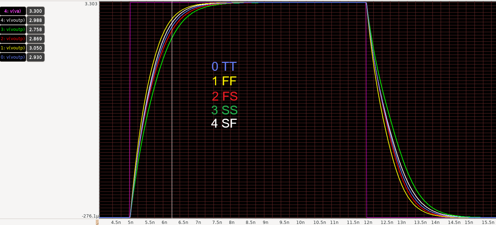
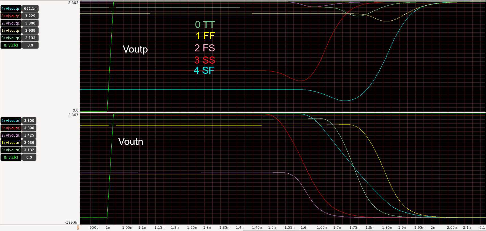
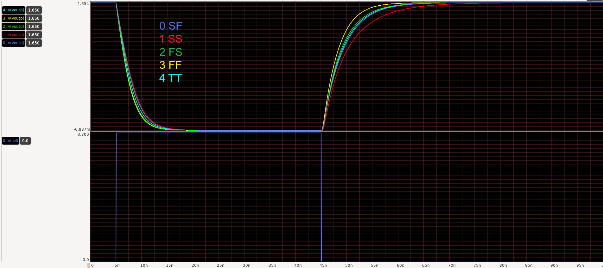

# Individual Component Results

Transient response of individual components at 5 corners (typical, SS, SF, FF, FS) at transistor level only.

# Transmission Gate

A simple transmission gate driving an ideal 5.12pF load

# Strong Arm Latch Comparator

A differential comparator that drives a 20fF load at each single ended output. Vin,diff = Vcm +/- 5mV

# DAC Switch 2-to-1

DAC driver that drives a 25.6pF load (512 times 50fF unit caps)

